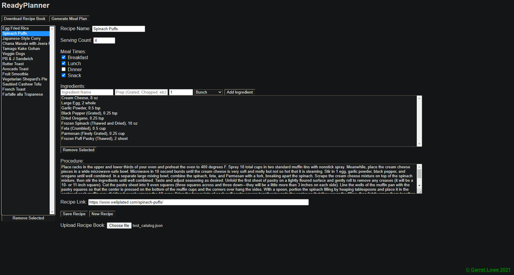
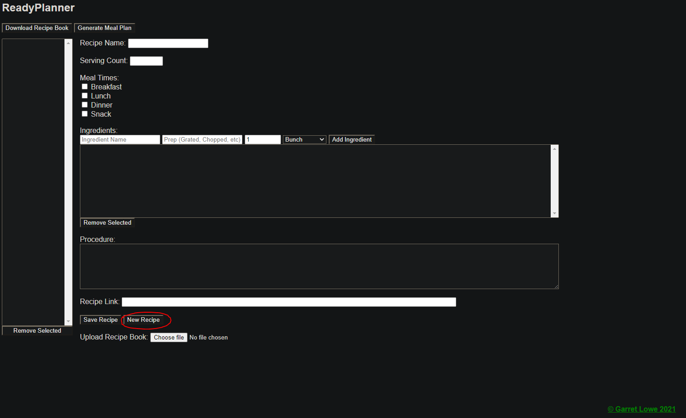
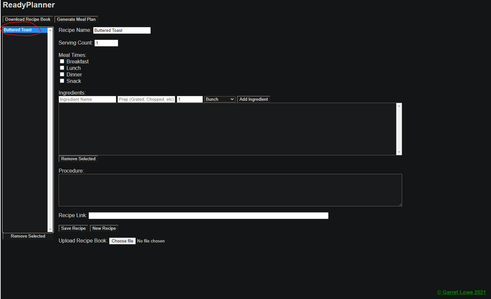
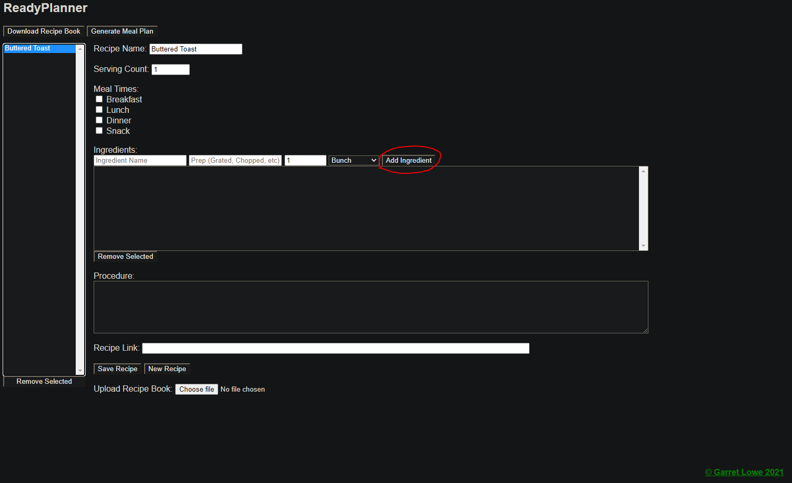
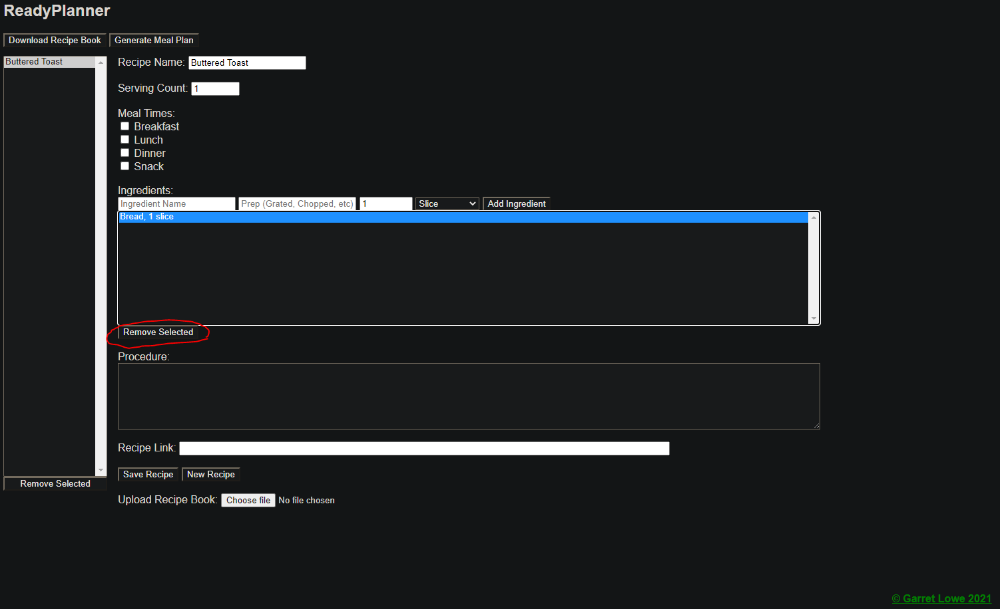
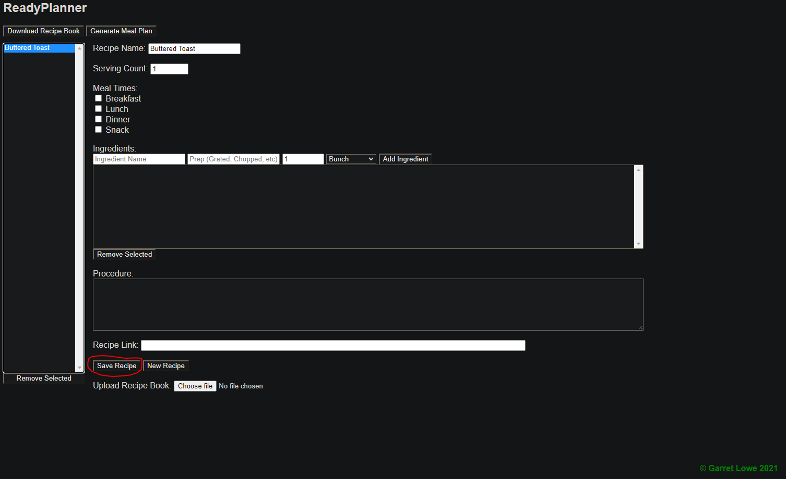
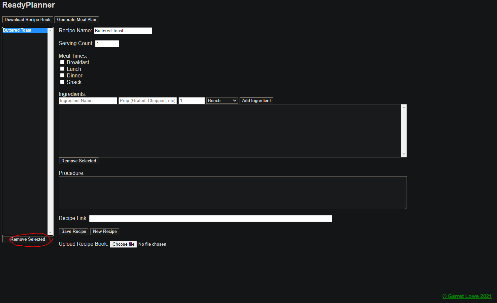
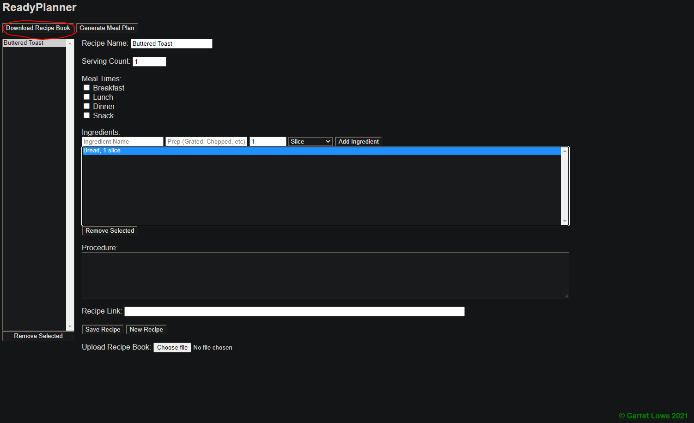
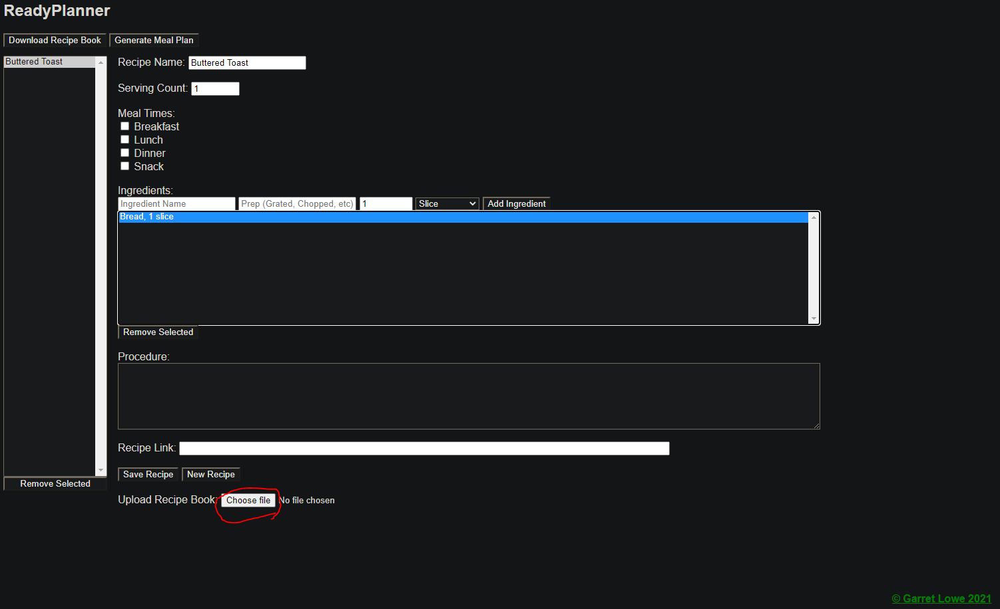

# ReadyPlanner
## Final Project for CP476 Internet Computing

ReadyPlanner is a meal planning web app which takes a set of recipes entered by the user and generates a meal plan for 1 week. In doing so, it takes into account the leftovers from previous days and prioritizes them in the future. Although, this priority is not absolute and leftovers may be skipped so meals never get stale. In generates your meal plan, ReadyPlanner will also create a shopping list containing all the ingredients your will need for the week.

### Inspiration

I personally struggle with getting inspiration for what to cook so I devised this web application to ease that. ReadyPlanner solves this problem by creating a meal plan to follow so no inspiration is required. If you want to try something different, simply add a new recipe to the recipe list in the web app.

### Instructions (How To)
#### Create a Recipe

Click **New Recipe** at the bottom of the page

You will be prompted to enter a new for your recipe, do so.

Now select your new recipe from the recipe list on the right side of the page.

Your recipe is now loaded and you may edit it.

#### Editing a Recipe

Recipes have many attributes and most are self explanatory. Here I'll explain some of the more obscure ones.

##### Meal Times

Meal times are used by the meal planner to decide when your recipe can be eaten (e.g., if your recipe is for dinner, the meal planner will only select it during the dinner time slot).

##### Ingredients

Ingredients work very similarly to Recipes. To add an ingredient, enter a name, amount, and select a unit then simply click **Add Ingredient**. 

Optionally you may also specify prep instructions. These are useful to remember when you are setting up your mise en place and will not be shown in the shopping list.

To remove an ingredient select it from the ingredient List and click **Remove Selected** below the ingredient list. Multiple ingredients can be selected and deleted at once.

##### Procedure

The procedure is the steps required to prepare your recipe. Think of this as the recipe itself. Simply enter your instructions into the box.

##### Recipe Link

If your recipe came from a website, you can save the link to the original recipe here. You can also feel free to leave this empty.

##### Saving a Recipe

To save your recipe simply click the **Save Recipe** button at the bottom of the page. 

If you forget to do this, you will be notified when switching to another recipe so your changes will not spontaneously disappear.

##### Deleting a Recipe

To delete a recipe, simply select it from the Recipe List on the right and click ** Remove Selected** below the recipe list.

#### Saving and Loading

To save your recipe book, click **Download Recipe Book** at the top of the page.

To load a recipe book, click **Choose file** at the bottom of the page and select your file from the file explorer.

When a recipe book is loaded it does not overwrite existing recipes so multiple can be loaded at the same time. Just remember to download your changes after you're done.

#### Generate a Meal Plan

To create a meal plan using your recipe book, click **Generate Meal Plan** at the top of the page.

This will automatically generate a meal plan and shopping list which will download as an XLSX file.

Uses [SheetJS](https://github.com/SheetJS/sheetjs) for document generation